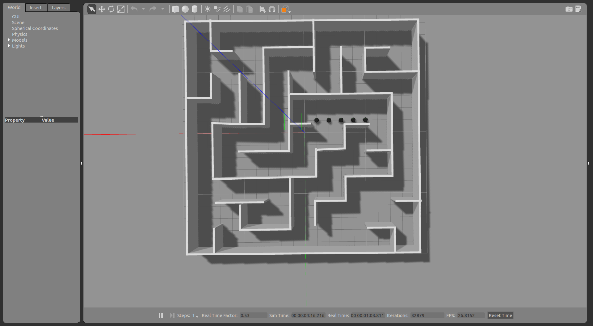
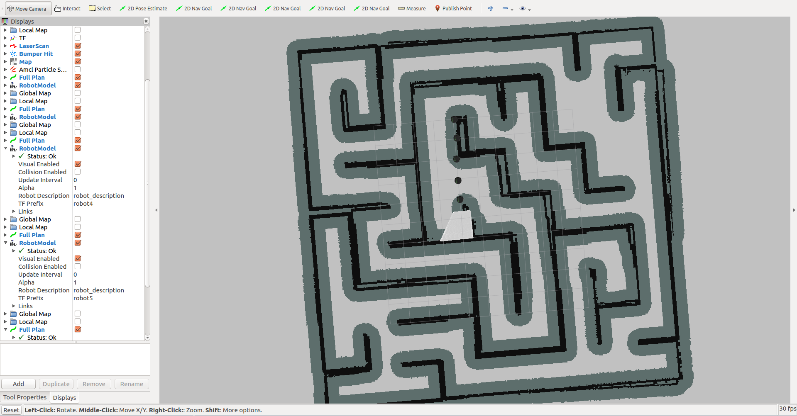
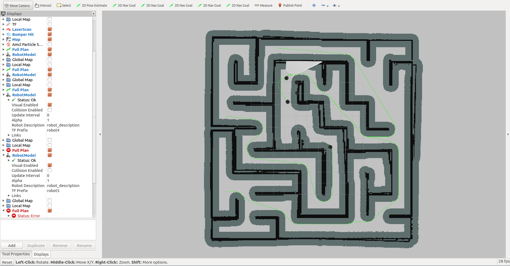

# Description

This is a set of configs of ROS Kinetic to generate multi robot(s)/agent(s) in Gazebo & Rviz simulation environment.

! PLEASE install ROS Kinetic FULL package before

U'r welcomed to open issues if found any problems

# Instruction

Download **myprofile** repo to your workspace/src location

# Launch 

Step 1: launch mp.launch

`roslaunch myprofile mp.launch robot_count:=5`

Step 2: launch amcl.launch

`roslaunch myprofile amcl.launch robot_count:=5`

After launch two **launch** files above, you should see the same windows as pics in **Screenshots**

> tip: in myrviz.rviz file, I saved 5 model of robots in it, so you'd best keep the *robot_count:=5* , otherwise  a modification of rviz config file (myprofile/launch/includes/myrviz.rviz) OR some items in GUI is needed

####  the overview calling sequence of files

As you can see multi files in this repo, the main calling sequence is as below:

> mp.launch -> one_robot_recur.launch ->  kobuki.launch.xml
>
> amcl.launch -> amcl_recur.launch && rviz ->  astra_amcl.launch.xml && move_base.launch.xml 

# Screenshots

**Point 5 goals for 5 robots**

